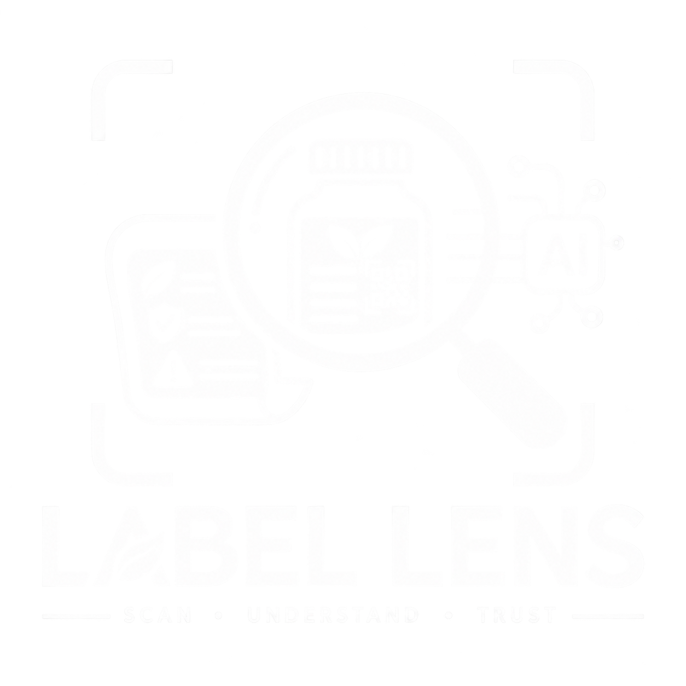

# Label Lens

<p align="center">
  
</p>

<h3 align="center">AI-Powered Packaged Commodity Compliance & Inspection System</h3>

<p align="center">Built for Smart India Hackathon 2026</p>

---

## SIH 2026 Problem Statement

**Problem Statement ID:** SIH26034

**Title:**  
Software System to check compliance of Packaged Commodities under Legal Metrology (Packaged Commodities) Rules, 2011 by scanning products, images and labels.

**Organization:** Ministry of Consumer Affairs, Food & Public Distribution

**Department:** Department of Consumer Affairs

---
## 🔗 Project Resources

- 🎥 **Demo Video:** [Click Here](https://drive.google.com/file/d/1WnfZzAmzrRv_XRRop1cJoBgUAiR7EySe/view?usp=drive_link)
- 📄 **Project Presentation / PDF:** [Click Here](https://drive.google.com/file/d/1oKHJWDfrx1dhiszYby_YXqkYZqhEYbQs/view?usp=drive_link)

---

## About Label Lens

**Label Lens** is an AI-assisted packaged-product compliance and inspection platform designed to help enforcement officers quickly verify whether product packaging follows applicable Legal Metrology requirements.

Instead of manually checking every declaration on a package, Label Lens allows an officer to scan product images and automatically:

- Extract information from packaging
- Identify mandatory declarations
- Detect missing or potentially incorrect information
- Apply product-specific compliance rules
- Explain violations with legal references
- Provide corrective suggestions
- Allow human verification and re-checking
- Generate digital compliance reports
- Maintain inspection history
- Provide administrative dashboards

---

## How It Works

```text
Product Images
      ↓
Image Preprocessing
      ↓
OCR using PaddleOCR
      ↓
AI Field Extraction
      ↓
Product / Category Detection
      ↓
3-Layer Compliance Rule Engine
      ↓
Violation Detection
      ↓
Severity & Compliance Score
      ↓
Officer Verification
      ↓
Compliance Report
```

---

## Key Features

### 🔍 Multi-View Product Scanning

Front and back images of the same product can be processed together as a single inspection.

### 📝 AI-Assisted OCR

Uses OpenCV and PaddleOCR to extract text from product packaging.

### 🤖 Intelligent Field Extraction

AI extracts important declarations including:

- Brand
- Product Name
- Generic Name
- Net Quantity
- MRP
- Manufacturer / Packer / Importer
- Consumer Care Information
- Manufacturing Date
- Best Before / Use By
- Country of Origin

### ⚖️ Product-Aware Rule Engine

Label Lens applies a layered compliance engine:

```text
General Rules
      +
Category-Specific Rules
      +
Product-Specific Rules
```

### 🚨 Explainable Violations

Detected violations can include:

- Severity
- Detected value
- Expected value
- Legal reference
- Explanation
- Suggested correction

### 👨‍💼 Human-in-the-Loop Verification

Officers can manually correct extracted information and re-run compliance checks.

### 📊 Compliance Scoring

Products receive a compliance score based on the severity of detected violations.

### 📄 Digital Compliance Reports

Generate structured inspection reports containing extracted fields, violations, scores and verification details.

### 📱 Camera Capture

Capture product images directly through the inspection interface.

### 🔗 Barcode / QR Support

Barcode and QR information can be captured as part of product verification.

### 🌐 Multi-Language Interface

Supports English and Hindi interface elements.

### 🛡️ Role-Based Access

Supports different user roles:

- Inspector
- Senior Inspector
- Controller
- Administrator

### 📈 Admin Dashboard

Provides visibility into:

- Total inspections
- Compliance rate
- Non-compliant products
- High-risk cases
- Officer activity
- Violation trends
- Product-category performance
- Inspection history

---

## Compliance Scoring

```text
Starting Score = 100

High Severity     → Major deduction
Medium Severity   → Moderate deduction
Low Severity      → Small deduction
Informational     → No deduction
```

The final score helps officers quickly identify products requiring attention.

---

## System Architecture

```text
┌──────────────────────────────┐
│        Product Images        │
│        Front + Back          │
└──────────────┬───────────────┘
               ↓
┌──────────────────────────────┐
│       OpenCV Processing      │
│   Resize / Crop / Enhance    │
└──────────────┬───────────────┘
               ↓
┌──────────────────────────────┐
│          PaddleOCR           │
│       Text Detection         │
└──────────────┬───────────────┘
               ↓
┌──────────────────────────────┐
│          Groq LLM            │
│       Field Extraction       │
└──────────────┬───────────────┘
               ↓
┌──────────────────────────────┐
│      Product Detection       │
│     Category Classification  │
└──────────────┬───────────────┘
               ↓
┌──────────────────────────────┐
│          Rule Engine         │
│                              │
│ General Rules                │
│ Category Rules               │
│ Product Rules                │
└──────────────┬───────────────┘
               ↓
┌──────────────────────────────┐
│      Compliance Result       │
│  Score + Violations + Fixes  │
└──────────────┬───────────────┘
               ↓
┌──────────────────────────────┐
│      Officer Verification    │
│       Re-check + Audit       │
└──────────────┬───────────────┘
               ↓
┌──────────────────────────────┐
│      Reports + Dashboards    │
└──────────────────────────────┘
```

---

## Technology Stack

### Frontend

- React.js
- TypeScript
- Vite
- HTML5
- CSS3

### Backend

- Python
- FastAPI
- Uvicorn
- Pydantic

### AI & Computer Vision

- OpenCV
- PaddleOCR
- Groq LLM

### Compliance

- Python Rule Engine
- Product-Specific Rules
- Category-Specific Rules

### Database & Authentication

- Supabase
- PostgreSQL
- Supabase Authentication

### Reporting & Verification

- ReportLab
- Barcode / QR Verification

### Development & Deployment

- Git
- GitHub
- Vercel
- npm
- Python Virtual Environment

---

## Project Structure

```text
product-label-compliance/
│
├── assets/
│   └── logo-white.png
│
├── screenshots/
│
├── backend/
│
├── frontend/
│
├── label_lens/
│
├── requirements.txt
├── .gitignore
└── README.md
```

---

## How to Run

### 1. Clone the Repository

```bash
git clone https://github.com/Divya-Singhal07/product-label-compliance.git
cd product-label-compliance
```

### 2. Create Python Environment

```bash
python3 -m venv venv
source venv/bin/activate
```

### 3. Install Dependencies

```bash
pip install -r requirements.txt
```

### 4. Configure Environment Variables

Create:

```bash
touch backend/.env
```

Add the required Supabase and Groq configuration.

> Never commit `.env` or expose API keys publicly.

### 5. Start Backend

```bash
python -m uvicorn backend.app:app --reload
```

Backend:

```text
http://127.0.0.1:8000
```

### 6. Start Frontend

Open another terminal:

```bash
cd frontend
npm install
npm run dev
```

Frontend:

```text
http://localhost:5173
```

---

## OCR Example

Label Lens can process multiple views of the same product as one inspection.

```bash
python -m label_lens.main_ocr \
  --input ~/Desktop/tf.png ~/Desktop/tb.png \
  --views front back
```

Where:

```text
tf.png → Front of product
tb.png → Back of product
```

---

## Compliance Workflow

```text
Officer Login
     ↓
Product Scanning
     ↓
Front + Back Images
     ↓
OCR
     ↓
AI Field Extraction
     ↓
Product / Category Detection
     ↓
Applicable Rules
     ↓
Compliance Analysis
     ↓
Violations + Score
     ↓
Officer Verification
     ↓
Re-check
     ↓
Compliance Report
     ↓
Inspection History
```

---

## Challenges & Mitigations

| Challenge | Mitigation |
|---|---|
| OCR Accuracy | Multi-view scanning + AI-assisted OCR |
| Complex Regulations | Product-specific layered rule engine |
| False Positives | Human verification + re-check workflow |
| Changing Regulations | Regular rule-engine and legal-reference updates |

---

## Impact

### Faster Inspections

Reduces time spent on manual label verification.

### Higher Consistency

Standardizes compliance checks across inspections.

### Reduced Human Error

AI-assisted extraction minimizes repetitive manual work.

### Better Enforcement

Helps identify high-risk and non-compliant products quickly.

### Digital Traceability

Maintains inspection records and compliance history.

### Scalable Compliance

The architecture can expand to additional product categories.

---

## Future Scope

- More product-specific compliance rules
- Improved OCR for difficult packaging
- Advanced visual placement analysis
- Real external barcode / QR verification
- Automated regulatory update pipeline
- Larger inspection datasets
- Advanced analytics
- Mobile inspection application
- Offline inspection capability
- Expanded multilingual support

---

## Regulatory References

Label Lens is designed around the regulatory framework for packaged commodities, including:

- Legal Metrology Act, 2009
- Legal Metrology (Packaged Commodities) Rules, 2011
- Relevant amendments and government notifications
- Department of Consumer Affairs resources
- Smart India Hackathon 2026 Problem Statement SIH26034

---

## Research & Technical References

### Computer Vision & OCR

- OpenCV
- PaddleOCR

### AI

- Groq LLM

### Backend

- FastAPI
- Pydantic
- Uvicorn

### Database

- Supabase
- PostgreSQL

### Reporting

- ReportLab

---

## Smart India Hackathon 2026

**Problem Statement:** SIH26034

**Project:** Label Lens

**Domain:** Software

**Organization:** Ministry of Consumer Affairs, Food & Public Distribution

**Department:** Department of Consumer Affairs

Label Lens aims to provide an AI-assisted digital workflow for packaged-commodity compliance inspection under the Legal Metrology framework.

---

## Team

### Team Label Lens

| Role | Responsibility |
|---|---|
| AI / Computer Vision | OCR, AI extraction & compliance intelligence |
| Frontend | User interface & inspection workflow |
| Backend | APIs, database & system integration |
| Research | Regulations, datasets & product rules |
| Research | Product-specific compliance analysis |
| Frontend / AI | UI + AI workflow integration |

---

## Contributing

Contributions, suggestions and improvements are welcome.

For major changes, please open an issue first to discuss the proposed changes.

---

## Support

If you encounter an issue while running the project:

1. Check the installation steps.
2. Verify environment variables.
3. Check that the backend is running.
4. Check that the frontend is running.
5. Open an issue with the error details.

---

<p align="center">

<b>Label Lens</b>

<br>

<i>Scan. Verify. Comply.</i>

<br><br>

Built for Smart India Hackathon 2026 🇮🇳

</p>
